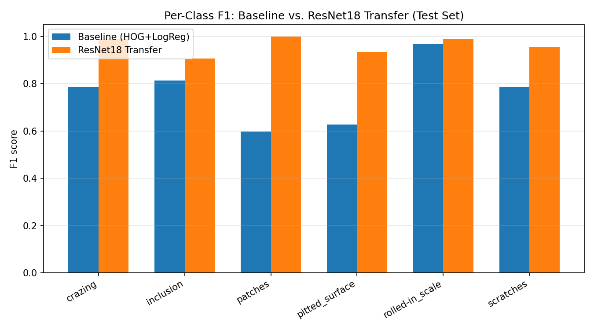

# NEU-CLS Steel Defect Classification

6-class steel surface defect classification via transfer learning, with
rigorous error analysis and Grad-CAM verification, deployed as a Streamlit
demo. See [WORKFLOW.md](WORKFLOW.md) for the full phase-by-phase plan.

**🔗 Live demo:** **[neu-cls-steel-defect-classification-b.streamlit.app](https://neu-cls-steel-defect-classification-b.streamlit.app/)**

**Status:** Phases 1–6 complete (data prep, classical baseline, ResNet18
transfer learning, error analysis, Grad-CAM verification, Streamlit demo).
Phase 7 (write-up) not yet done.

## Results

Final, held-out **test set** (270 images, touched exactly once per model —
see `reports/error_analysis.md` for the full methodology):

| Metric | HOG + Logistic Regression (baseline) | ResNet18 Transfer Learning |
|---|---|---|
| Accuracy | 77.0% | **96.3%** |
| Precision (macro) | 0.770 | **0.963** |
| Recall (macro) | 0.770 | **0.963** |
| F1 (macro) | 0.763 | **0.963** |

5-fold cross-validation on the development set (train+val, 1,529 images)
gave **0.970 ± 0.005 mean F1** at the selected epoch — consistent with the
270-image held-out test result above, i.e. no meaningful train/test gap.

| Class | Baseline F1 | ResNet18 F1 |
|---|---|---|
| crazing | 0.785 | **0.989** |
| inclusion | 0.813 | **0.907** |
| patches | 0.597 | **1.000** |
| pitted_surface | 0.627 | **0.935** |
| rolled-in_scale | 0.968 | **0.989** |
| scratches | 0.787 | **0.956** |



**Key error-analysis finding** (`reports/error_analysis.md`): the baseline's
single biggest failure mode — 15 of 45 `patches` test images misclassified
as `crazing` — is **fully resolved** by the ResNet18 model (0 such errors).
ResNet18's own remaining confusion is smaller and different: mostly
`inclusion` mixed up with `pitted_surface`/`scratches` (the Streamlit demo
flags this automatically, see below).


**Key Grad-CAM finding** (`reports/gradcam_analysis.md`): for 5 of 6
classes, the model's attention plausibly overlaps visible defect texture.
`crazing` is a flagged exception — its heatmaps consistently concentrate
in a corner/edge region rather than spreading across the image the way
real crazing texture does. Based on only 3 examples, so treated as a
hypothesis worth further investigation, not a settled conclusion — see the
full report for the honest, evidence-graded write-up (including why
Grad-CAM is evidence, not proof).

## Dataset

NEU-CLS: 1,800 grayscale-content 200x200 images, 6 classes, 300 images per
class (`crazing`, `inclusion`, `patches`, `pitted_surface`, `rolled-in_scale`,
`scratches`).

**Note on the source archive:** the provided `NEU-CLS.zip` (not committed to
git — see `.gitignore`) contains image files *alongside* object-detection
annotations (YOLO-format bounding-box `.txt` labels, laid out as
`train/train/images/` + `train/train/labels/`, `valid/valid/images/` +
`valid/valid/labels/`). This project uses **only the images**, for 6-class
whole-image classification, and **intentionally ignores the detection
labels** — no bounding-box information is used anywhere in this pipeline.
Concretely:

- Only the `.jpg` images are extracted; the `.txt` bounding-box label files are never read.
- The zip's own train(295)/valid(5) per-class split is a detection split, not
  a classification split — it is discarded.
- A fresh, fixed, stratified 70/15/15 split (1,259 / 270 / 270 images) is
  built from the pooled 1,800 images and frozen under `data/splits/`. One
  exact-duplicate pair was found and resolved (see
  `reports/data_integrity.md`), leaving 1,799 unique images.

## Setup

```bash
git clone https://github.com/Arshanapally-Akshith/neu-cls-steel-defect-classification.git
cd neu-cls-steel-defect-classification
pip install -r requirements.txt
# PyTorch is CPU-only in requirements.txt; for a CUDA build instead, see:
# https://pytorch.org/get-started/locally/
```

## Try it locally

```bash
streamlit run streamlit_app.py
```

`models/resnet18_finetuned.pt` is committed to this repo, so this works
immediately on a fresh clone — no training required. Upload a steel-surface
image and the app shows the predicted defect class, its confidence, a
Grad-CAM overlay, and (if applicable) a note when the prediction falls into
the `inclusion`/`pitted_surface`/`scratches` confusion group identified
above. The app is a thin UI layer only: all model loading, preprocessing,
prediction, and Grad-CAM logic is reused as-is from `src/models/transfer.py`
and `src/gradcam/gradcam.py`, never reimplemented.

## Reproducing the full pipeline

Each phase's script is idempotent and reads only the frozen artifacts the
previous phase produced — never re-derives them. Not required to try the
demo (above); only needed if you want to regenerate results from scratch.

```bash
python -m scripts.run_phase1               # data integrity + frozen 70/15/15 split
python -m scripts.run_phase2_baseline       # HOG + Logistic Regression baseline
python -m scripts.run_phase3_transfer       # ResNet18 transfer learning (~30 min on CPU)
python -m scripts.run_phase4_error_analysis # per-sample error analysis vs. both models
python -m scripts.run_phase5_gradcam        # Grad-CAM heatmaps + honest attention analysis
```

Each writes its report(s) under `reports/` (see that directory for the
full list) and, where applicable, a model artifact under `models/`. Those
are gitignored and regenerable via the scripts above — except
`models/resnet18_finetuned.pt`, which is committed as a deliberate
exception so the Streamlit demo works without retraining first.

## Tests

```bash
pytest
```

98 tests. Covers: dataset integrity, split correctness/reproducibility, the
HOG baseline pipeline (including no train/val/test leakage), the ResNet18
training/CV/evaluation pipeline (including a regression test that the
frozen test manifest is never read during cross-validation), Phase 4's
error-analysis utilities (including a bug-regression test), Phase 5's
Grad-CAM implementation (including a real-checkpoint, read-only
integration test), and Phase 6's single-image prediction helper plus
Streamlit-app smoke tests (via `streamlit.testing.v1.AppTest`).

## Repo Structure

```
├── streamlit_app.py             # Phase 6 demo (thin UI layer, reuses src/)
├── requirements.txt
├── config/config.yaml           # every phase's settings, one file
├── src/
│   ├── config.py                 # config.yaml loader
│   ├── data/                     # extraction, indexing, integrity, splitting, loading
│   ├── features/                 # HOG feature extraction (Phase 2)
│   ├── models/                   # baseline.py (Phase 2), transfer.py (Phase 3, ResNet18)
│   ├── eval/                     # shared metrics, confusion matrix, error analysis
│   └── gradcam/                  # Grad-CAM, image selection, visualization (Phase 5)
├── scripts/                     # one orchestrator script per phase
├── data/
│   ├── raw/                      # extracted images (gitignored)
│   └── splits/                   # frozen split manifests (committed)
├── models/                      # trained model artifacts — gitignored/regenerable,
│                                 #   except resnet18_finetuned.pt (committed for the demo)
├── reports/                     # every phase's report + figures (committed)
└── tests/                       # one test module per component
```
