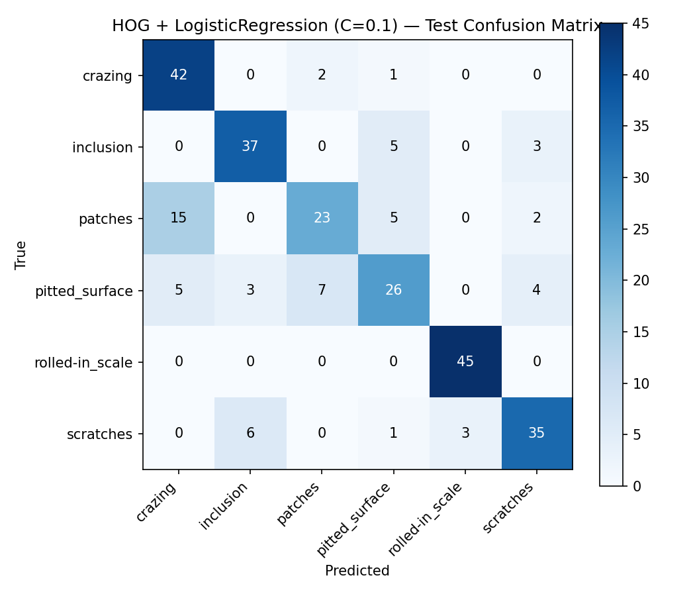

# Phase 2 — Classical Baseline: HOG + Logistic Regression

Generated: 2026-08-08

Loads images strictly through the frozen Phase 1 manifests (`data/splits/{train,val,test}.csv`) — the split is not recreated or modified here. HOG features are extracted per image; the feature scaler and Logistic Regression classifier are fit ONLY on the train split. The val split is used exclusively to pick the regularization strength `C`. The test split is touched exactly once, after `C` was already chosen, for final reporting.

## Split Sizes (from frozen Phase 1 manifests)

- train: 1259
- val: 270
- test: 270

## Configuration

- Grayscale input: `True`
- HOG orientations: `9`
- HOG pixels_per_cell: `[16, 16]`
- HOG cells_per_block: `[2, 2]`
- HOG block_norm: `L2-Hys`
- Logistic Regression solver: `lbfgs`
- Logistic Regression max_iter: `5000`
- C grid searched (on val): `[0.001, 0.01, 0.1, 1.0, 10.0, 100.0]`
- Selection metric (val): `f1_macro`
- Random state: `42`
- **Selected C: `0.1`**

## Hyperparameter Search (Validation Set)

| C | val accuracy | val precision (macro) | val recall (macro) | val F1 (macro) | selected |
|---|---|---|---|---|---|
| 0.001 | 0.8222 | 0.8240 | 0.8222 | 0.8190 |  |
| 0.01 | 0.8481 | 0.8468 | 0.8481 | 0.8458 |  |
| 0.1 | 0.8519 | 0.8509 | 0.8519 | 0.8499 | **yes** |
| 1.0 | 0.8148 | 0.8114 | 0.8148 | 0.8110 |  |
| 10.0 | 0.8185 | 0.8171 | 0.8185 | 0.8174 |  |
| 100.0 | 0.8185 | 0.8171 | 0.8185 | 0.8174 |  |

## Validation Results (Selected Model, C=0.1)

- Accuracy: **0.8519**
- Precision (macro): 0.8509, (weighted): 0.8509
- Recall (macro): 0.8519, (weighted): 0.8519
- F1 (macro): 0.8499, (weighted): 0.8499

## Final Test Results (Touched Once)

- Accuracy: **0.7704**
- Precision (macro): 0.7696, (weighted): 0.7696
- Recall (macro): 0.7704, (weighted): 0.7704
- F1 (macro): 0.7627, (weighted): 0.7627

### Per-Class Metrics (Test)

| Class | Precision | Recall | F1 | Support |
|---|---|---|---|---|
| crazing | 0.6774 | 0.9333 | 0.7850 | 45 |
| inclusion | 0.8043 | 0.8222 | 0.8132 | 45 |
| patches | 0.7188 | 0.5111 | 0.5974 | 45 |
| pitted_surface | 0.6842 | 0.5778 | 0.6265 | 45 |
| rolled-in_scale | 0.9375 | 1.0000 | 0.9677 | 45 |
| scratches | 0.7955 | 0.7778 | 0.7865 | 45 |

### Confusion Matrix (Test)

| True \\ Pred | crazing | inclusion | patches | pitted_surface | rolled-in_scale | scratches |
|---|---|---|---|---|---|---|
| crazing | 42 | 0 | 2 | 1 | 0 | 0 |
| inclusion | 0 | 37 | 0 | 5 | 0 | 3 |
| patches | 15 | 0 | 23 | 5 | 0 | 2 |
| pitted_surface | 5 | 3 | 7 | 26 | 0 | 4 |
| rolled-in_scale | 0 | 0 | 0 | 0 | 45 | 0 |
| scratches | 0 | 6 | 0 | 1 | 3 | 35 |
