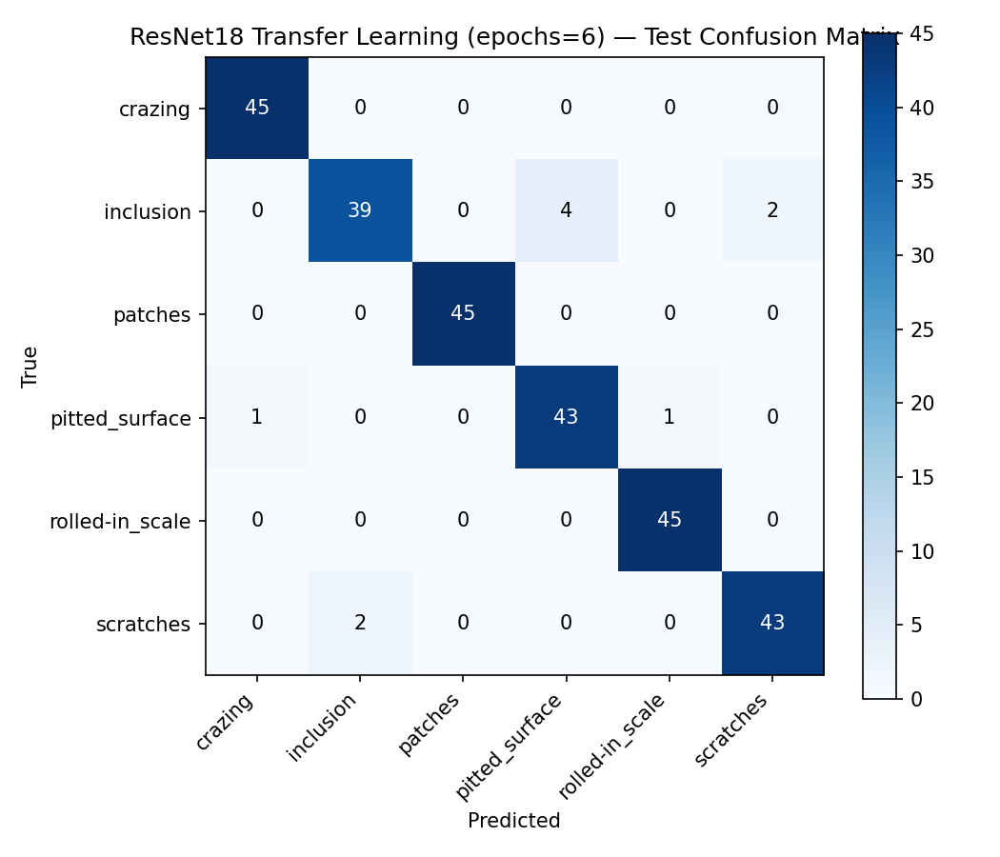

# Phase 3 — ResNet18 Transfer Learning

Generated: 2026-08-08

Loads images strictly through the frozen Phase 1 manifests (`data/splits/{train,val,test}.csv`) — the split is not recreated or modified here. "Development" (dev) data = train + val pooled. Stratified k-fold cross-validation runs on dev only and is used to select the number of training epochs (best mean val f1_macro across folds). The final model is retrained from scratch on the full dev set for that many epochs, and the test manifest is loaded and predicted on exactly once, after the epoch count was already fixed by CV.

## Split Sizes (from frozen Phase 1 manifests)

- train: 1259
- val: 270
- dev (train + val, used for CV): 1529
- test (untouched until final evaluation): 270

## Configuration

- Backbone: `resnet18` (ImageNet-pretrained: `True`)
- Freeze backbone: `True` (only the replaced FC head is trained)
- Input size: `[224, 224]`
- Augmentation (train only): RandomResizedCrop(scale=[0.85, 1.0]), horizontal_flip=True, vertical_flip=True, rotation=±15° — no color jitter (grayscale content)
- Optimizer: `adam`, lr=0.001, weight_decay=0.0001, batch_size=32
- Max epochs per CV fold: 6
- CV folds: 5, selection metric: `f1_macro`
- Seed: 42
- **Selected epoch count (via CV): 6**

## k-Fold Cross-Validation Results (Development Set)

Mean ± std across folds, per epoch (val metrics):

| Epoch | val accuracy (mean±std) | val f1_macro (mean±std) | selected |
|---|---|---|---|
| 1 | 0.7619 ± 0.0737 | 0.7438 ± 0.0835 |  |
| 2 | 0.9411 ± 0.0126 | 0.9402 ± 0.0131 |  |
| 3 | 0.9549 ± 0.0137 | 0.9543 ± 0.0142 |  |
| 4 | 0.9660 ± 0.0111 | 0.9655 ± 0.0116 |  |
| 5 | 0.9692 ± 0.0117 | 0.9691 ± 0.0119 |  |
| 6 | 0.9699 ± 0.0048 | 0.9698 ± 0.0049 | **yes** |

## Final Test Results (Touched Once)

- Accuracy: **0.9630**
- Precision (macro): 0.9630, (weighted): 0.9630
- Recall (macro): 0.9630, (weighted): 0.9630
- F1 (macro): 0.9626, (weighted): 0.9626

### Per-Class Metrics (Test)

| Class | Precision | Recall | F1 | Support |
|---|---|---|---|---|
| crazing | 0.9783 | 1.0000 | 0.9890 | 45 |
| inclusion | 0.9512 | 0.8667 | 0.9070 | 45 |
| patches | 1.0000 | 1.0000 | 1.0000 | 45 |
| pitted_surface | 0.9149 | 0.9556 | 0.9348 | 45 |
| rolled-in_scale | 0.9783 | 1.0000 | 0.9890 | 45 |
| scratches | 0.9556 | 0.9556 | 0.9556 | 45 |

### Confusion Matrix (Test)

| True \\ Pred | crazing | inclusion | patches | pitted_surface | rolled-in_scale | scratches |
|---|---|---|---|---|---|---|
| crazing | 45 | 0 | 0 | 0 | 0 | 0 |
| inclusion | 0 | 39 | 0 | 4 | 0 | 2 |
| patches | 0 | 0 | 45 | 0 | 0 | 0 |
| pitted_surface | 1 | 0 | 0 | 43 | 1 | 0 |
| rolled-in_scale | 0 | 0 | 0 | 0 | 45 | 0 |
| scratches | 0 | 2 | 0 | 0 | 0 | 43 |

## Comparison vs. Phase 2 HOG + Logistic Regression Baseline (Test Set)

| Metric | Baseline (HOG+LogReg) | ResNet18 Transfer | Delta |
|---|---|---|---|
| Accuracy | 0.7704 | 0.9630 | +0.1926 |
| Precision (macro) | 0.7696 | 0.9630 | +0.1934 |
| Recall (macro) | 0.7704 | 0.9630 | +0.1926 |
| F1 (macro) | 0.7627 | 0.9626 | +0.1998 |
