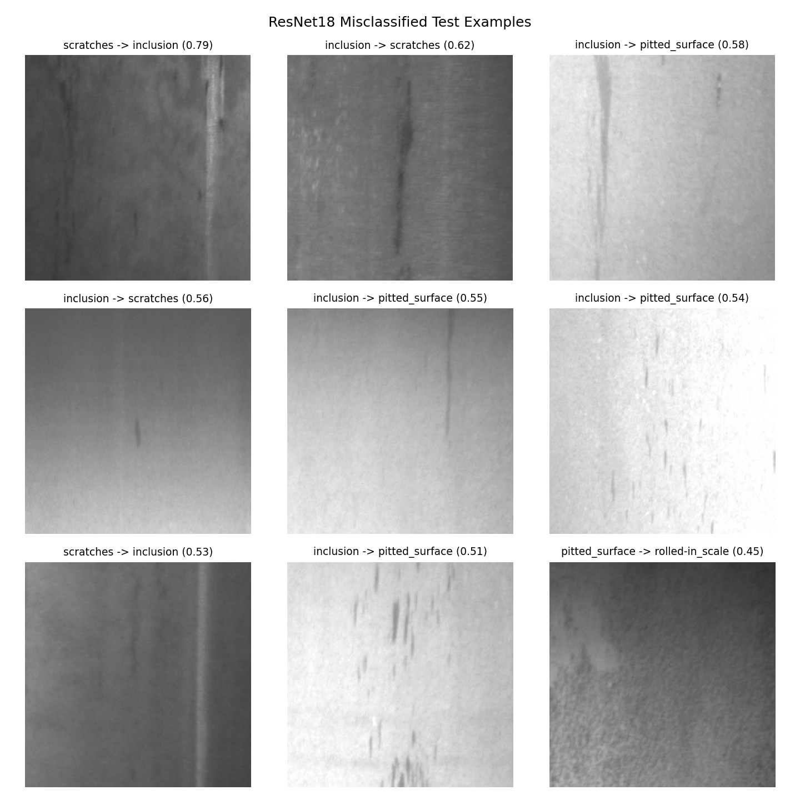

# Phase 4 — Error Analysis

Generated: 2026-08-08

This phase re-runs **inference only** (no training) for the already-trained Phase 2 (`models/baseline.joblib`) and Phase 3 (`models/resnet18_finetuned.pt`) models on the frozen test manifest (`data/splits/test.csv`), to recover the per-sample predictions and confidences that Phase 2/3 only summarized as aggregate metrics. Neither model, the split, nor the test data were modified. As a consistency check, the re-computed aggregate test metrics for both models were verified to match the previously reported Phase 2/3 results (max abs difference: 0.00e+00).

## Full Confusion Matrix — ResNet18 (Test)

| True \\ Pred | crazing | inclusion | patches | pitted_surface | rolled-in_scale | scratches |
|---|---|---|---|---|---|---|
| crazing | 45 | 0 | 0 | 0 | 0 | 0 |
| inclusion | 0 | 39 | 0 | 4 | 0 | 2 |
| patches | 0 | 0 | 45 | 0 | 0 | 0 |
| pitted_surface | 1 | 0 | 0 | 43 | 1 | 0 |
| rolled-in_scale | 0 | 0 | 0 | 0 | 45 | 0 |
| scratches | 0 | 2 | 0 | 0 | 0 | 43 |

## Full Confusion Matrix — HOG + Logistic Regression Baseline (Test)

| True \\ Pred | crazing | inclusion | patches | pitted_surface | rolled-in_scale | scratches |
|---|---|---|---|---|---|---|
| crazing | 42 | 0 | 2 | 1 | 0 | 0 |
| inclusion | 0 | 37 | 0 | 5 | 0 | 3 |
| patches | 15 | 0 | 23 | 5 | 0 | 2 |
| pitted_surface | 5 | 3 | 7 | 26 | 0 | 4 |
| rolled-in_scale | 0 | 0 | 0 | 0 | 45 | 0 |
| scratches | 0 | 6 | 0 | 1 | 3 | 35 |

## Per-Class Precision / Recall / F1 — ResNet18 (Test)

| Class | Precision | Recall | F1 | Support |
|---|---|---|---|---|
| crazing | 0.9783 | 1.0000 | 0.9890 | 45 |
| inclusion | 0.9512 | 0.8667 | 0.9070 | 45 |
| patches | 1.0000 | 1.0000 | 1.0000 | 45 |
| pitted_surface | 0.9149 | 0.9556 | 0.9348 | 45 |
| rolled-in_scale | 0.9783 | 1.0000 | 0.9890 | 45 |
| scratches | 0.9556 | 0.9556 | 0.9556 | 45 |

## Per-Class Precision / Recall / F1 — Baseline (Test)

| Class | Precision | Recall | F1 | Support |
|---|---|---|---|---|
| crazing | 0.6774 | 0.9333 | 0.7850 | 45 |
| inclusion | 0.8043 | 0.8222 | 0.8132 | 45 |
| patches | 0.7188 | 0.5111 | 0.5974 | 45 |
| pitted_surface | 0.6842 | 0.5778 | 0.6265 | 45 |
| rolled-in_scale | 0.9375 | 1.0000 | 0.9677 | 45 |
| scratches | 0.7955 | 0.7778 | 0.7865 | 45 |

## Most Important Confusion Pairs

### ResNet18 (top 5 by count)

| True | Predicted | Count |
|---|---|---|
| inclusion | pitted_surface | 4 |
| inclusion | scratches | 2 |
| scratches | inclusion | 2 |
| pitted_surface | crazing | 1 |
| pitted_surface | rolled-in_scale | 1 |

### Baseline (top 5 by count)

| True | Predicted | Count |
|---|---|---|
| patches | crazing | 15 |
| pitted_surface | patches | 7 |
| scratches | inclusion | 6 |
| inclusion | pitted_surface | 5 |
| patches | pitted_surface | 5 |

## Explicit Check: `patches` → `crazing` Confusion (Phase 2 Finding)

Phase 2's error analysis found 15 of 45 true `patches` test images misclassified as `crazing` by the HOG+LogReg baseline (33% of the class). ResNet18 misclassifies 0 `patches` images as `crazing` on the same test set — **fully resolved**.

## Representative Predictions — ResNet18

### Correct (highest confidence per class)

| Filename | Class | Confidence |
|---|---|---|
| crazing_208.jpg | crazing | 0.9989 |
| inclusion_86.jpg | inclusion | 0.9853 |
| patches_166.jpg | patches | 0.9989 |
| pitted_surface_58.jpg | pitted_surface | 0.9942 |
| rolled-in_scale_43.jpg | rolled-in_scale | 0.9986 |
| scratches_23.jpg | scratches | 0.9992 |

### All Misclassified (10 of 270)

| Filename | True | Predicted | Confidence |
|---|---|---|---|
| scratches_96.jpg | scratches | inclusion | 0.7883 |
| inclusion_282.jpg | inclusion | scratches | 0.6186 |
| inclusion_230.jpg | inclusion | pitted_surface | 0.5794 |
| inclusion_228.jpg | inclusion | scratches | 0.5567 |
| inclusion_253.jpg | inclusion | pitted_surface | 0.5472 |
| inclusion_240.jpg | inclusion | pitted_surface | 0.5413 |
| scratches_69.jpg | scratches | inclusion | 0.5341 |
| inclusion_234.jpg | inclusion | pitted_surface | 0.5147 |
| pitted_surface_97.jpg | pitted_surface | rolled-in_scale | 0.4488 |
| pitted_surface_273.jpg | pitted_surface | crazing | 0.3173 |

## Representative Predictions — Baseline (`patches` → `crazing` examples)

| Filename | True | Predicted | Confidence |
|---|---|---|---|
| patches_66.jpg | patches | crazing | 0.9969 |
| patches_74.jpg | patches | crazing | 0.9948 |
| patches_255.jpg | patches | crazing | 0.9621 |
| patches_190.jpg | patches | crazing | 0.8807 |
| patches_139.jpg | patches | crazing | 0.8204 |
| patches_25.jpg | patches | crazing | 0.7813 |
| patches_284.jpg | patches | crazing | 0.7583 |
| patches_240.jpg | patches | crazing | 0.7482 |
| patches_205.jpg | patches | crazing | 0.7149 |
| patches_24.jpg | patches | crazing | 0.6970 |
| patches_226.jpg | patches | crazing | 0.6716 |
| patches_228.jpg | patches | crazing | 0.6101 |
| patches_162.jpg | patches | crazing | 0.6092 |
| patches_100.jpg | patches | crazing | 0.5742 |
| patches_266.jpg | patches | crazing | 0.5116 |

## Systematic vs. Isolated Errors — ResNet18

For each true class: total test errors, how many *distinct* wrong classes those errors were spread across, and the single most common wrong prediction (if any). A class whose errors concentrate into one dominant wrong class is a systematic confusion; a class whose few errors are spread across several different wrong classes looks more like isolated noise than a learned confusion.

| Class | Correct | Total Errors | Distinct Wrong Classes | Dominant Confusion |
|---|---|---|---|---|
| crazing | 45 | 0 | 0 | — |
| inclusion | 39 | 6 | 2 | pitted_surface (x4) |
| patches | 45 | 0 | 0 | — |
| pitted_surface | 43 | 2 | 2 | crazing (x1) |
| rolled-in_scale | 45 | 0 | 0 | — |
| scratches | 43 | 2 | 1 | inclusion (x2) |

3 of 6 classes (crazing, patches, rolled-in_scale) have zero test errors. 1 class(es) with errors (scratches) concentrate ALL their errors into a single dominant wrong class — a systematic (not random) confusion. 2 class(es) (inclusion, pitted_surface) spread their errors across multiple different wrong classes, which looks more like isolated noise than one specific learned confusion.

## Error Overlap: ResNet18 vs. Baseline (Same 270 Test Images)

| Category | Count |
|---|---|
| both correct | 202 |
| both wrong | 4 |
| baseline only wrong | 58 |
| resnet only wrong | 6 |

4 test image(s) fool **both** models — these are the hardest examples in the test set, independent of model architecture. 58 image(s) that the baseline got wrong are correctly classified by ResNet18 (fixed by transfer learning); 6 image(s) the baseline got right are missed by ResNet18 (new errors introduced by the switch).

### Images Both Models Get Wrong

| Filename | True | Baseline Pred | ResNet18 Pred |
|---|---|---|---|
| inclusion_234.jpg | inclusion | scratches | pitted_surface |
| inclusion_282.jpg | inclusion | pitted_surface | scratches |
| pitted_surface_97.jpg | pitted_surface | patches | rolled-in_scale |
| scratches_96.jpg | scratches | inclusion | inclusion |

## Artifacts

- Per-sample predictions (both models, all 270 test images): `error_analysis_predictions.csv`
- ResNet18 confusion matrix: `transfer_confusion_matrix.png`
- Baseline confusion matrix: `baseline_confusion_matrix.png`
- Per-class F1 comparison chart: `error_analysis_f1_comparison.png`
- ResNet18 misclassified-examples grid: `error_analysis_misclassified_grid.png`
