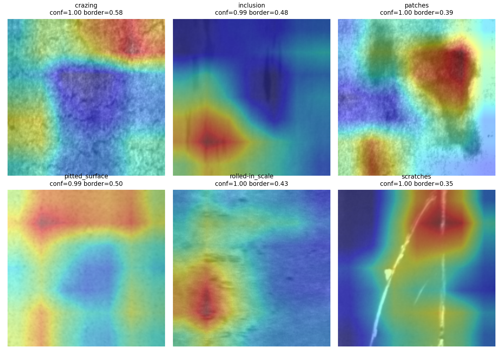
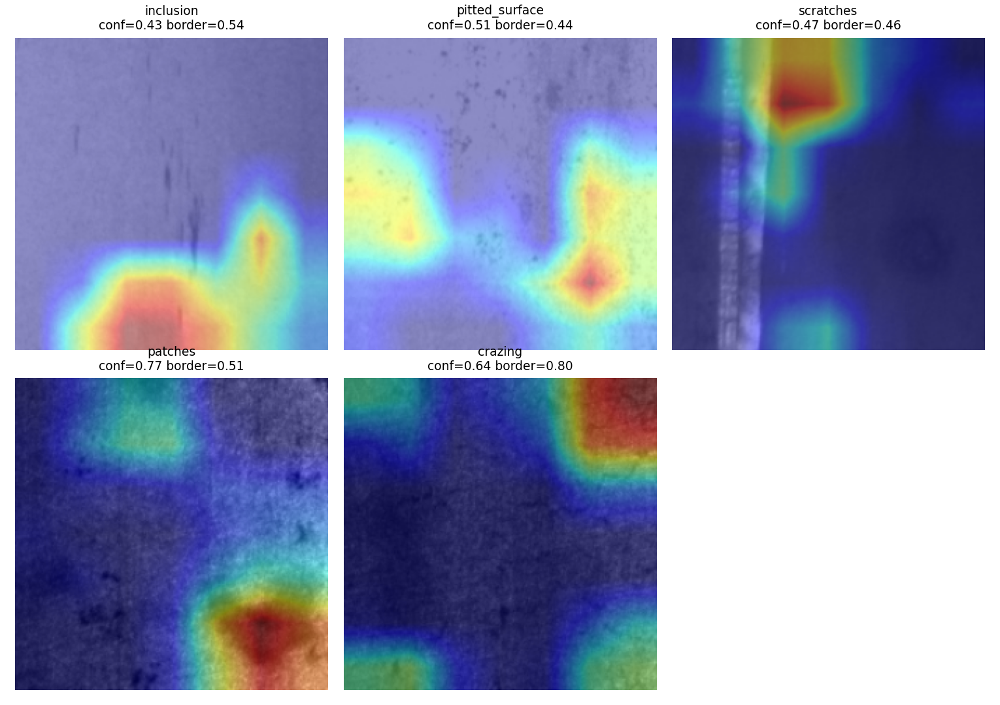
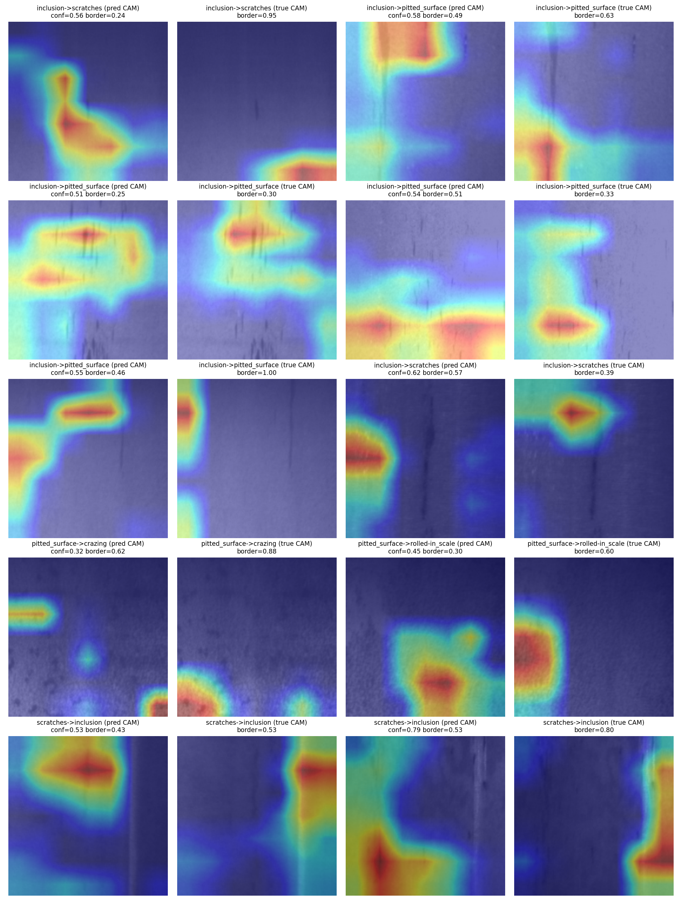

# Phase 5 — Grad-CAM Verification

Generated: 2026-08-08

**What this phase does and does not show.** Grad-CAM (Selvaraju et al., 2017) visualizes where the gradient of a predicted class's score is concentrated in the final convolutional feature map (`layer4[-1]` of the frozen ResNet18 backbone, a 7x7 spatial grid upsampled to 224x224 for display). This is **evidence about local gradient sensitivity, not proof of causal reasoning** — a high-activation region is a place the model's score is sensitive to, not necessarily the *reason* it chose that class, and Grad-CAM cannot see anything the frozen, generic-ImageNet backbone's 512-dim pooled features didn't already discard. Findings below are reported honestly, including if the model appears to attend to non-defect regions — that would be a legitimate finding about this specific model, not a failure of the analysis.

Images were selected from Phase 4's per-sample predictions table (`reports/error_analysis_predictions.csv`) — never re-derived. Neither the ResNet18 model nor the frozen test split were modified; both were re-hashed before and after this run (see console log). 21 test images were explained (6 correct-representative, one per class; 5 additional low-confidence-correct examples from confusion-prone classes; 10 incorrect — all of ResNet18's test errors, per Phase 4).

## Method

- Target layer: `model.layer4[-1]` (last BasicBlock of ResNet18's final conv stage)
- CAM: global-average-pooled gradient weights over channel activations, ReLU'd, normalized to [0,1] (standard Grad-CAM)
- Overlay: `jet` colormap, alpha=0.45, blended over the same 224x224 resize the model sees
- Border-energy fraction: a quantitative proxy computed on the raw 7x7 CAM — the share of total activation energy in the outer ~15% border ring. High values are *consistent with* (not proof of) a border/background shortcut; this number supports the visual read below, it doesn't replace it.

## Correctly Classified — One Representative per Class

| Filename | Class | Confidence | Border Energy Frac. |
|---|---|---|---|
| crazing_208.jpg | crazing | 0.9989 | 0.5838 |
| inclusion_86.jpg | inclusion | 0.9853 | 0.4793 |
| patches_166.jpg | patches | 0.9989 | 0.3943 |
| pitted_surface_58.jpg | pitted_surface | 0.9942 | 0.5011 |
| rolled-in_scale_43.jpg | rolled-in_scale | 0.9986 | 0.4290 |
| scratches_23.jpg | scratches | 0.9992 | 0.3470 |

### Visual assessment — correct predictions

For most classes, the hot region plausibly overlaps a visible defect: `inclusion_86` concentrates on a dark streak near the bottom-left where a linear mark is visible; `patches_166` sits on the mottled blob in the upper-right; `pitted_surface_58` covers two darker pit-like regions top and bottom-left; `rolled-in_scale_43` sits over a blemished patch bottom-left; `scratches_23` lands on the upper portion of a visible scratch line.

`crazing_208` is the outlier: the hot region is a compact blob in the **top-right corner**, not the diffuse, whole-surface fine-crack network that crazing defects actually look like. Crazing is a texture that should, if anything, cover most of the image rather than one corner. This is also the **highest border-energy fraction of the six** (0.584) and, as the next two sections show, this corner/edge concentration for the crazing class recurs across every other crazing-related example in this analysis — not a one-off.

## Confusion-Prone Classes — Additional Low-Confidence Correct Examples

Classes Phase 4 flagged via top confusion pairs (`inclusion, pitted_surface, scratches, patches, crazing`), showing their least-confident still-correct predictions — the borderline cases most informative about whether attention degrades before the prediction does.

| Filename | Class | Confidence | Border Energy Frac. |
|---|---|---|---|
| inclusion_238.jpg | inclusion | 0.4299 | 0.5350 |
| pitted_surface_134.jpg | pitted_surface | 0.5127 | 0.4422 |
| scratches_134.jpg | scratches | 0.4717 | 0.4610 |
| patches_240.jpg | patches | 0.7729 | 0.5107 |
| crazing_171.jpg | crazing | 0.6422 | 0.8013 |

### Visual assessment — confusion-prone classes

`inclusion_238`, `pitted_surface_134`, and `scratches_134` all show attention landing on plausible interior texture — a dark blob and a smaller secondary spot for inclusion, two pit-like clusters for pitted_surface, and a hot region right at the top of a visible scratch line for scratches. `patches_240` splits attention between a faint upper region and a stronger lower blob, both plausible patch texture.

`crazing_171` is again the outlier, and more strongly this time: the hot region sits in the **top-right corner** — the same corner as `crazing_208` above — and its border-energy fraction (0.801) is not just the highest of these five, it's the highest of **any** correctly classified example in this entire analysis. Two independently selected crazing images, at two different confidence levels (0.999 and 0.642), both put nearly all their gradient weight in the same corner region. That consistency across unrelated images is what turns this from an isolated oddity into a pattern worth flagging.

Border-energy fractions here also don't cleanly separate "confusion-prone" from "representative": excluding crazing, the other four confusion-prone values (0.535, 0.442, 0.461, 0.511) are close to the representative-class values in the section above, so lower confidence alone doesn't obviously correlate with more border-heavy attention for these four classes — the crazing effect looks class-specific, not a general low-confidence artifact.

## Incorrectly Classified — All ResNet18 Test Errors

Each misclassified image gets TWO CAMs: one for the class the model actually predicted (what evidence drove the wrong answer) and one for the true class (whether evidence for the right answer was present but was outweighed, or simply wasn't there).

| Filename | True | Predicted | Confidence | Border Frac. (pred CAM) | Border Frac. (true CAM) |
|---|---|---|---|---|---|
| inclusion_228.jpg | inclusion | scratches | 0.5567 | 0.2412 | 0.9503 |
| inclusion_230.jpg | inclusion | pitted_surface | 0.5794 | 0.4880 | 0.6267 |
| inclusion_234.jpg | inclusion | pitted_surface | 0.5147 | 0.2524 | 0.3034 |
| inclusion_240.jpg | inclusion | pitted_surface | 0.5413 | 0.5138 | 0.3326 |
| inclusion_253.jpg | inclusion | pitted_surface | 0.5472 | 0.4591 | 1.0000 |
| inclusion_282.jpg | inclusion | scratches | 0.6186 | 0.5710 | 0.3942 |
| pitted_surface_273.jpg | pitted_surface | crazing | 0.3173 | 0.6188 | 0.8816 |
| pitted_surface_97.jpg | pitted_surface | rolled-in_scale | 0.4488 | 0.2950 | 0.6021 |
| scratches_69.jpg | scratches | inclusion | 0.5341 | 0.4251 | 0.5261 |
| scratches_96.jpg | scratches | inclusion | 0.7883 | 0.5325 | 0.8030 |

### Visual assessment — misclassified examples

Two distinct patterns show up across the ten errors:

**Genuine visual ambiguity (most `inclusion`↔`pitted_surface`/`scratches` confusions).** For `inclusion_230`, `inclusion_234`, `inclusion_240`, and `scratches_69`, the predicted-class CAM and the true-class CAM land on the *same or adjacent* regions of the image — both centered on the same faint vertical mark or streak. In these cases the model isn't looking somewhere strange for the wrong answer; it's looking at a genuinely ambiguous mark and landing on the wrong side of a close call. That's a legitimate hard-example story, not a shortcut story.

**True-class evidence collapsing to the border.** In several errors the true-class CAM is far more border-concentrated than the predicted-class CAM for the same image: `inclusion_228` (true-CAM border 0.950 vs. pred-CAM 0.241), `inclusion_253` (1.000 vs. 0.459), `pitted_surface_273` (0.882 vs. 0.619), `scratches_96` (0.803 vs. 0.532). Averaged across all 10 errors, the true-class CAM's mean border-energy fraction is **0.642**, versus **0.440** for the predicted (wrong) class's CAM — when the model is wrong, its "evidence" for what the answer *should* have been is systematically more edge-concentrated than its evidence for the answer it actually gave. Read together with the correct-example findings above, this is consistent with the model's decision genuinely being driven by interior texture (right or wrong), while its signal for classes it didn't pick is often just leftover gradient at the image edges rather than suppressed defect evidence.

`pitted_surface_273` (true `pitted_surface`, predicted `crazing`) directly connects to the crazing pattern above: the predicted-class (crazing) CAM sits as a horizontal band hugging the **left edge** of the image — a third independent image where the model's crazing-class score concentrates on an image edge rather than distributed texture.

## Quantitative Summary: Border-Energy Fraction by Group

| Group | n | Mean | Median | Min | Max |
|---|---|---|---|---|---|
| correct_representative (pred CAM) | 6 | 0.456 | 0.454 | 0.347 | 0.584 |
| confusion_prone_correct (pred CAM) | 5 | 0.550 | 0.511 | 0.442 | 0.801 |
| incorrect (pred CAM) | 10 | 0.440 | 0.474 | 0.241 | 0.619 |
| incorrect (true CAM) | 10 | 0.642 | 0.614 | 0.303 | 1.000 |

A uniform 7x7 CAM with all energy spread evenly would have a border fraction of about 0.49 (a 1-cell-wide ring at 15% width per side covers 24 of the grid's 49 cells). Values below that indicate energy concentrated toward the center; values above it lean toward the edge — though this alone doesn't distinguish a genuinely edge-focused CAM from one that's simply diffuse. This number is a coarse signal, read alongside the images above, not instead of them.

## Overall Assessment

**For five of six classes (`inclusion`, `patches`, `pitted_surface`, `rolled-in_scale`, `scratches`), Grad-CAM attention plausibly overlaps visible surface texture/marks** in the images inspected, and most `inclusion`-related misclassifications look like genuine visual ambiguity — the model attends to the same region regardless of which class it's scoring, and simply lands on the wrong side of a close call. That's the behavior you'd want from a model reasoning about defect texture, not a shortcut.

**`crazing` is a specific, reproducible exception.** All three crazing-class-score CAMs examined — two correct predictions at different confidence levels (`crazing_208`, conf 0.999, border 0.584; `crazing_171`, conf 0.642, border 0.801) and one incorrect prediction (`pitted_surface_273`, predicted crazing, border 0.619) — concentrate in a corner or edge region rather than spreading across the image the way the crazing defect's fine, diffuse crack network visually does. These are also the two highest border-energy fractions among all eleven correctly classified examples in this analysis. Three independent images pointing the same direction is a real pattern, not noise — though with only three examples it should be treated as a flag for further investigation (e.g. Grad-CAM on a larger crazing sample, or checking whether crazing images share a lighting/vignette artifact in this dataset) rather than a settled conclusion.

**Net read:** border-energy fraction is only a coarse spatial proxy — it shows where gradient mass falls relative to the image edge, not why the model made a decision, and it cannot establish that the model is using genuinely causal defect features. Read strictly, the aggregate comparison does not provide evidence of systematic border reliance in the tested errors: correct-example mean 0.456 vs. incorrect predicted-class mean 0.440 is not a meaningful difference once `crazing`'s two outliers are set aside, and most classes show plausible, texture-aligned attention on direct visual inspection. That absence of an aggregate effect is not itself proof the model is defect-driven either — it simply means this proxy, at this sample size, didn't detect systematic border reliance. `crazing` remains a separate, narrower observation: a consistent edge-concentration signal across the three examples available. That should be read as a limited hypothesis (n=3), not a dataset-level conclusion — this model's crazing predictions warrant caution beyond what its accuracy number alone (98.9% F1 on this class, from Phase 4) would suggest, pending investigation with a larger sample.

## Limitations

- **Evidence, not proof.** Grad-CAM shows gradient sensitivity, not a causal explanation. A model can produce a plausible-looking heatmap while still reasoning in ways that don't generalize (or vice versa: a diffuse heatmap doesn't necessarily mean the model reasoned poorly).
- **Coarse resolution.** The CAM's native resolution is 7x7 (image downsampled 32x by ResNet18's stride); each cell corresponds to a 32x32 region of the 224x224 input. Fine-grained defect boundaries cannot be resolved at this granularity — "the model attends to the defect" can only be claimed at the scale of roughly a seventh of the image, not pixel-precise.
- **Frozen, generic-ImageNet backbone.** Only the final linear layer was trained (Phase 3); the conv features themselves were never adapted to steel-defect imagery specifically. Any attention pattern reflects what ImageNet-pretrained features happen to respond to, filtered through a linear readout — not features learned for this task.
- **Small, non-random sample.** 21 images were deliberately selected (representative/confusion-prone/all-errors), not randomly sampled — appropriate for illustrating specific cases, but this is not a statistically powered claim about the model's attention in general.

## Artifacts

- Per-sample Grad-CAM summary (all 21 explained images): `gradcam_summary.csv`
- Correct-examples grid: `gradcam/correct_examples_grid.png`
- Confusion-prone examples grid: `gradcam/confusion_prone_grid.png`
- Incorrect-examples grid: `gradcam/incorrect_examples_grid.png`
- Individual heatmap overlays (one/two PNGs per image): `gradcam/`
